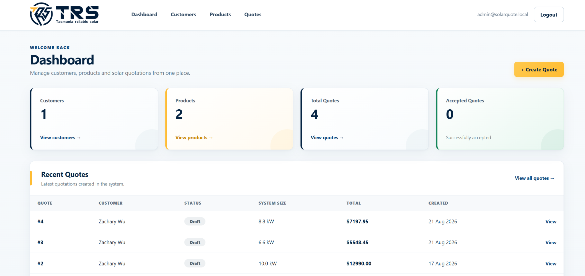
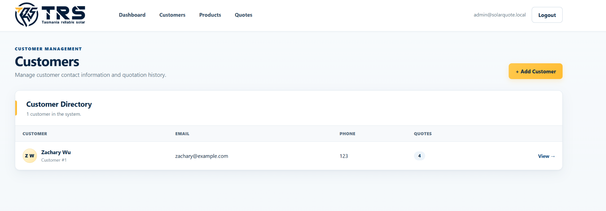
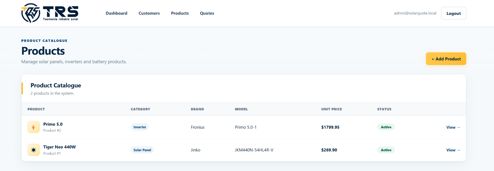
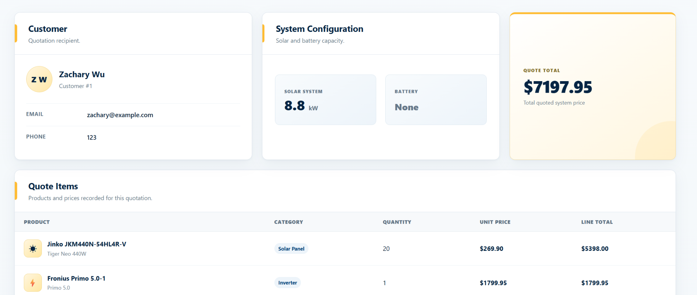
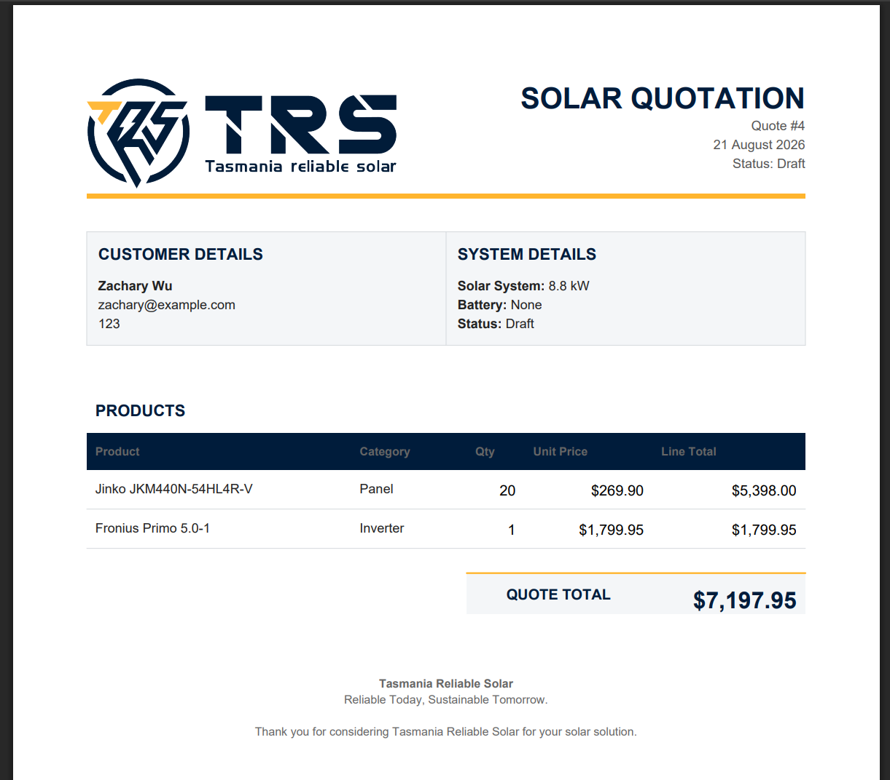

# Solar Quote Management System

A full-stack web application for managing customers, solar products, quotations, pricing, and professional PDF quote generation.



The system was designed around a practical solar sales workflow, allowing users to maintain a product catalogue, create customer quotations, preserve historical pricing, manage quote statuses, and generate professional PDF proposals from a central application.

---

## Overview

Solar businesses often need to manage customer information, product pricing, system configurations, and quotations across multiple tools or documents.

The **Solar Quote Management System** brings these tasks together into a single web application.

The system provides a structured workflow for:

- managing customers;
- maintaining a solar product catalogue;
- creating and editing quotations;
- tracking quotation status;
- preserving historical quoted prices;
- calculating quotation totals; and
- generating professional PDF quotations.

The application uses a Flask application factory and modular Blueprint structure, with SQLAlchemy for database management and Flask-Login for authentication.

---

## Key Features

### Dashboard

The dashboard provides a central overview of the quotation system, including:

- total customers;
- total products;
- total quotations;
- accepted quotations; and
- recently created quotes.

### Customer Management

Users can:

- create customers;
- edit customer information;
- view customer details;
- view quotation history associated with a customer; and
- delete customers when no quotations are associated with them.

### Product Catalogue

The product catalogue supports:

- solar panels;
- inverters;
- batteries;
- product pricing;
- product editing; and
- active/inactive product status.

Inactive products are excluded when creating new quotations while remaining available to historical quotations.

### Quote Management

Users can create and manage solar quotations containing:

- a customer;
- solar system size;
- optional battery capacity;
- multiple products;
- product quantities;
- quotation status; and
- automatically calculated totals.

Supported quotation statuses are:

- Draft
- Sent
- Accepted
- Rejected

### Snapshot Pricing

The system implements **snapshot pricing** to preserve historical quotation accuracy.

When a product is added to a quotation, its current catalogue price is copied into the corresponding quote item.

This means that changing the catalogue price later does **not** modify the price stored in an existing quotation.

For example:

```text
Product catalogue price at quotation creation: $249.90

Quote Item:
Unit Price = $249.90

Product catalogue later changes to: $269.90

Historical Quote Item:
Unit Price = $249.90
```

This separates:

```text
Product.unit_price
    = current catalogue price

QuoteItem.unit_price
    = historical quoted price
```

### PDF Quote Generation

Quotations can be rendered as professional PDF documents containing customer details, system configuration, products, quantities, unit prices, totals, and company branding.

PDF documents are generated server-side using ReportLab.

### Authentication

The application includes authenticated access using Flask-Login.

Protected application routes require the user to sign in before accessing customer, product, and quotation management functionality.

---


## Screenshots

### Dashboard

A central overview of customers, products, quotation activity, and recently created quotes.


### Customer Management

Customer records and quotation history can be managed from a dedicated customer directory.



### Product Catalogue

Solar panels, inverters, batteries, catalogue pricing, and product availability are managed through the product catalogue.



### Quote Management

Each quotation combines customer information, solar system configuration, product quantities, snapshot pricing, and automatically calculated totals.



### PDF Quotation

The application generates branded PDF quotations suitable for presenting solar system details and pricing to customers.



---

## Tech Stack

| Area | Technology |
|---|---|
| Backend | Python, Flask |
| Database | SQLite |
| ORM | SQLAlchemy |
| Database Migrations | Flask-Migrate / Alembic |
| Authentication | Flask-Login |
| Frontend | HTML, CSS, Jinja2 |
| PDF Generation | ReportLab |
| Version Control | Git / GitHub |

The project also includes PostgreSQL and Gunicorn dependencies for future production deployment.

---

## Application Architecture

The application follows Flask's **Application Factory Pattern** and separates major functionality using **Blueprints**.

```text
SolarQuoteManagementSystem/
│
├── app/
│   ├── blueprints/
│   │   ├── auth/
│   │   ├── customers/
│   │   ├── main/
│   │   ├── products/
│   │   └── quotes/
│   │
│   ├── models/
│   ├── services/
│   ├── static/
│   │   ├── css/
│   │   └── images/
│   │
│   ├── templates/
│   │   ├── auth/
│   │   ├── customers/
│   │   ├── main/
│   │   ├── products/
│   │   └── quotes/
│   │
│   ├── __init__.py
│   └── extensions.py
│
├── migrations/
├── tests/
├── config.py
├── requirements.txt
└── run.py
```

This structure separates routing, data models, business services, templates, and static assets to keep the application maintainable as it grows.

---

## Data Model

The core data relationships are:

```text
Customer
   │
   │ One-to-Many
   ▼
 Quote
   │
   │ One-to-Many
   ▼
QuoteItem
   │
   │ Many-to-One
   ▼
 Product
```

A customer can have multiple quotations.

A quotation can contain multiple quote items.

Each quote item references a product while storing its own quantity and historical unit price.

---

## Quote Pricing Model

Each quotation line calculates:

```text
Line Total = Quantity × Snapshot Unit Price
```

The quotation total is calculated from all quote items:

```text
Quote Total = Sum of all Line Totals
```

Because each `QuoteItem` stores its own unit price, historical quotations remain stable even when product catalogue prices change.

---

## Project Setup

### 1. Clone the repository

```bash
git clone https://github.com/awu416/solar-quote-management-system.git
cd solar-quote-management-system
```

### 2. Create a virtual environment

Windows:

```bash
python -m venv .venv
```

Activate it:

```powershell
.\.venv\Scripts\Activate.ps1
```

### 3. Install dependencies

```bash
pip install -r requirements.txt
```

### 4. Configure environment variables

Create a `.env` or configure the required environment variables for your environment.

Example:

```text
SECRET_KEY=your-secret-key-here
```

The application uses SQLite as the default local database.

### 5. Apply database migrations

```bash
flask --app run.py db upgrade
```

### 6. Run the application

```bash
python run.py
```

Then open the local Flask development server in your browser.

---

## Database Migrations

Database schema changes are managed using Flask-Migrate and Alembic.

Create a migration:

```bash
flask --app run.py db migrate -m "Migration description"
```

Apply migrations:

```bash
flask --app run.py db upgrade
```

---

## Security and Repository Hygiene

Sensitive and machine-specific files are excluded from version control, including:

```text
.env
.venv/
instance/
__pycache__/
*.pyc
.vscode/
```

Secrets should be provided through environment variables rather than committed to the repository.

---

## Design

The user interface follows a consistent visual system inspired by Tasmania Reliable Solar branding.

The interface uses:

- deep navy for navigation and primary information;
- solar yellow for primary actions and highlights;
- light blue and neutral surfaces for information hierarchy;
- semantic status indicators for quotation and product states; and
- responsive layouts for different screen sizes.

---

## Future Improvements

Potential future development includes:

- PostgreSQL production database deployment;
- cloud deployment;
- role-based access control;
- quote search and filtering;
- reporting and analytics;
- email delivery of quotations;
- automated quote numbering;
- expanded customer information;
- automated testing coverage; and
- additional solar system configuration options.

---

## Project Purpose

This project was developed as a practical full-stack software engineering project to demonstrate:

- backend web development with Flask;
- relational database design;
- CRUD operations;
- authentication;
- business rule implementation;
- server-side validation;
- historical data integrity;
- PDF document generation;
- responsive user interface design; and
- Git-based development workflow.

---

## Author

**Zachary Wu**